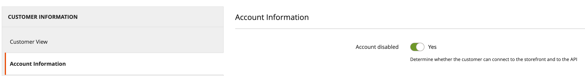
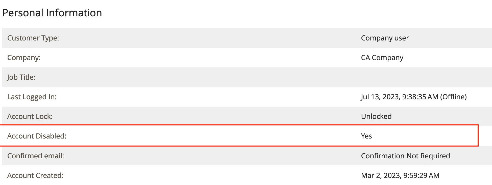
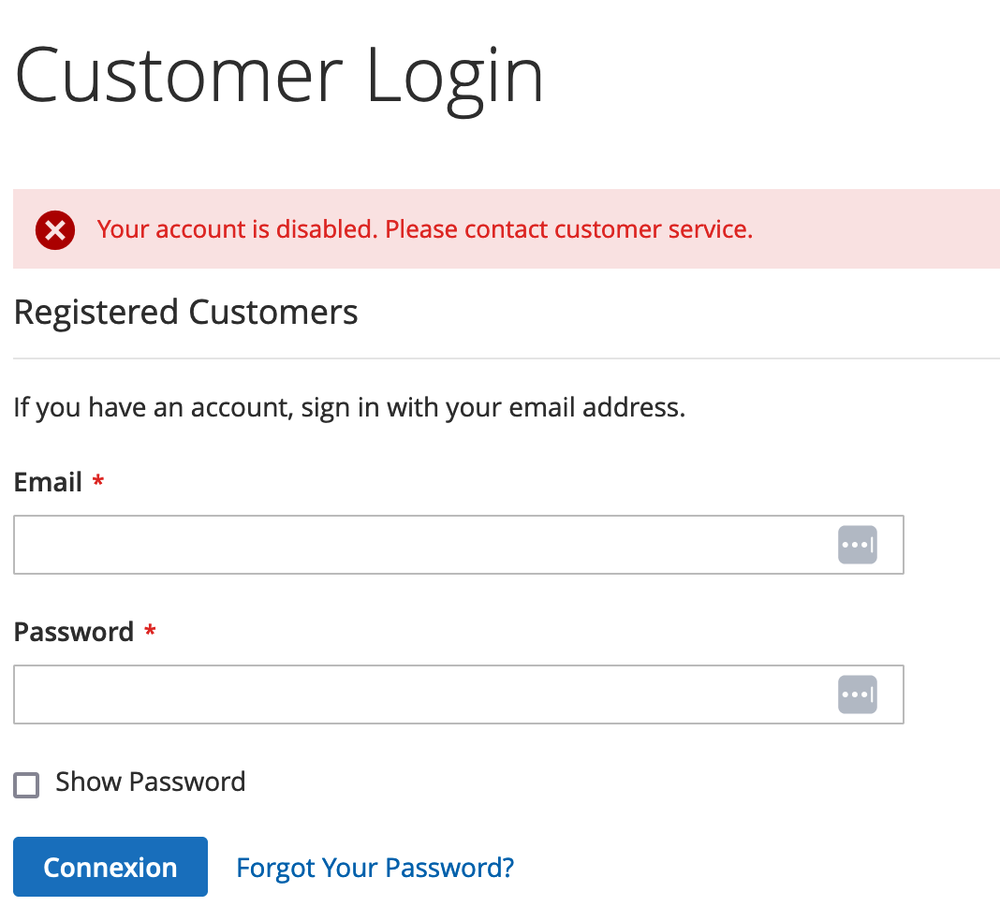

# Omakazit DisableCustomer Extension

This Magento 2 extension, designed to enhance the administrative functionality of the platform, provides the capability to disable customer accounts directly from the admin panel. This module aims to streamline account management processes for administrators, ensuring efficient control over customer accounts.

By installing and activating this module, administrators gain access to an additional option within the customer management section of the admin panel. From there, they can conveniently disable a specific customer account with a simple click, restricting the customer's ability to log in, make purchases, or perform any other activities associated with their account.

This module empowers administrators to quickly and effectively handle situations where customer accounts need to be temporarily or permanently deactivated. It offers a user-friendly interface, ensuring ease of use and reducing the time required to perform administrative tasks.

With the ability to disable customer accounts, the module helps maintain security, manage customer interactions, and enforce policies as needed. Whether it's addressing fraudulent activities, handling customer requests for temporary account suspension, or managing other account-related issues, this module provides a valuable tool for administrators to efficiently handle such scenarios.

Overall, this Magento 2 extension enhances the functionality of the admin panel by enabling administrators to disable customer accounts seamlessly. Its streamlined approach to account management promotes effective customer relationship management and ensures a secure and controlled environment for online store operations.

## Features
* Disable/Enable Customer Account
  * Customer login is not allowed via storefront or api
* Disable/Enable Customer Account Creation
  * Customer account creation block on login page is removed
  * Customer account creation link in header is removed
  * Customer account creation page redirects to login page

## Installation
```
composer require omakazit/m2-disable-customer
bin/magento set:up
bin/magento indexer:reindex customer_grid
```

## Configurations
Go to Stores > Configuration > Omakazit Extensions > Disable Customer

## How to disable/enable a customer account
In the administration panel, select a customer for whom you wish to disable/enable the account.
Customer > All customers > Select a customer

On the customer edit page click on the **Account information** tab.

**Disable/Enable** the account using the switch button.



You can view the current account status in the "**Personal information**" section of "**Customer view**" tab.



You can also filter accounts in customer grid based on this attribute

## Results
### Storefront
A customized error message will be displayed when a disabled customer account attempts to login.

To edit error message go to Stores > Configuration > Omakazit Extensions > Disable Customer > Error Message


### API
The original error message will be displayed when a disabled customer account attempts to login.
```
The account sign-in was incorrect or your account is disabled temporarily. Please wait and try again later.
```

## Logs
Stores > Configuration > Omakazit Extensions > Disable Customer > Debug Disabling Customer

If debug mode is enabled then logs will be located at var/log/omakazit/disable-customer.log

## Requirements
 - Adobe Commerce/Magento Open Source 2.4.x
 - PHP 8.x

